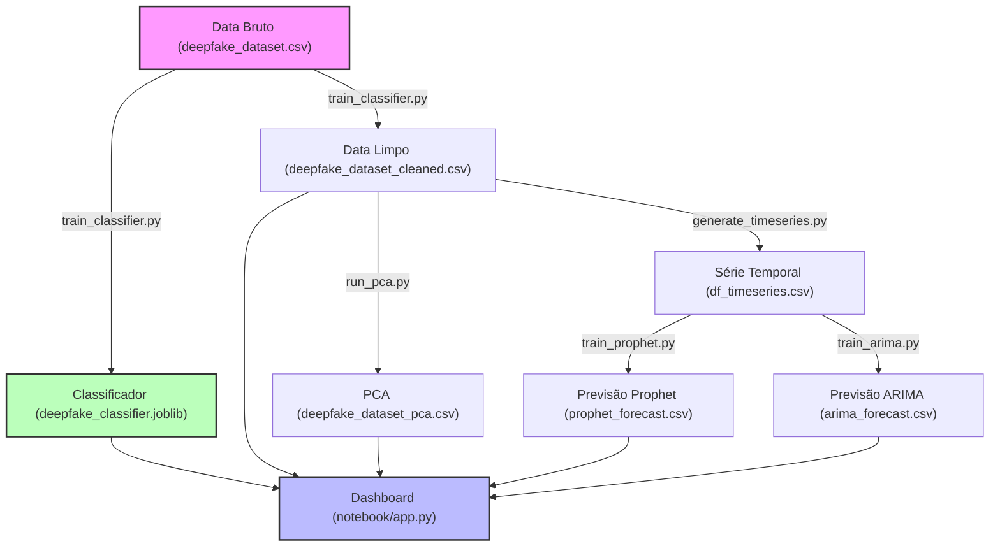

# 🛡️ Deepfake Detection Research

Projeto de pesquisa aplicada para detecção de mídias sintéticas (deepfakes) utilizando técnicas avançadas de Machine Learning supervisionado, redução de dimensionalidade e modelagem preditiva de séries temporais.

---

## 🛠️ Stack Tecnológica


---

## 🏗️ Arquitetura do Sistema

O projeto é estruturado como uma pipeline de dados modular, onde cada etapa gera artefatos específicos que alimentam o dashboard interativo final:



---

## 📂 Estrutura do Repositório

```text
.
├── assets/                          # Gráficos e matrizes estáticas gerados pelas pipelines
├── data/
│   ├── processed/                   # Artefatos e datasets gerados (CSVs, joblib, JSONs)
│   └── raw/                         # Dataset bruto original (ex: deepfake_dataset.csv)
├── notebook/
│   ├── app.py                       # Dashboard Streamlit interativo
│   ├── deepfake_forensics.py        # Protótipo rápido da pipeline
│   └── deepfake_notebook.ipynb      # Notebook de pesquisa e exploração
├── scripts/                         # Módulos independentes da pipeline
│   ├── generate_timeseries.py       # Conversão do dataset em série temporal diária
│   ├── run_pca.py                   # Análise de Componentes Principais (PCA)
│   ├── train_arima.py               # Previsão temporal usando ARIMA
│   ├── train_classifier.py          # Treinamento do classificador RandomForest
│   └── train_prophet.py             # Previsão temporal usando Prophet
├── tests/
│   └── test_smoke.py                # Testes de fumaça e contratos de dados
├── .github/workflows/ci.yml         # Workflow de Integração Contínua
├── requirements.txt                 # Dependências do projeto
└── README.md                        # Documentação do projeto
```

---

## 🎯 Resultados e Métricas Atuais

Os artefatos versionados em `data/processed/` registram o seguinte desempenho:

| Componente | Métricas / Resultados | Descrição / Detalhes |
| :--- | :--- | :--- |
| **Classificador** | Acurácia: **88.26%**<br>Precisão: **80.98%**<br>Recall: **100.00%**<br>ROC AUC: **96.98%** | RandomForest treinado com pesos balanceados para prevenção de vazamento de dados (`generation_method` e `media_id` removidos). |
| **PCA** | Variância Acumulada: **96.11%** (4 Componentes) | Redução de dimensionalidade com foco na análise de separabilidade das features. |
| **Forecasting** | ARIMA & Prophet | Série diária simulada contendo previsões completas para avaliação comparativa direta no dashboard. |

---

## 🚀 Como Preparar e Executar

### 1. Preparar o Ambiente
Crie um ambiente virtual e instale todas as dependências do projeto:
```bash
python3 -m venv --without-pip .venv
curl -sS https://bootstrap.pypa.io/get-pip.py | .venv/bin/python3
.venv/bin/pip install -r requirements.txt streamlit plotly
```

### 2. Executar a Pipeline de Dados
Você pode reexecutar cada etapa da pipeline individualmente para gerar novos artefatos:
```bash
# 1. Classificação
.venv/bin/python scripts/train_classifier.py

# 2. PCA
.venv/bin/python scripts/run_pca.py

# 3. Série Temporal e Forecasting
.venv/bin/python scripts/generate_timeseries.py
.venv/bin/python scripts/train_prophet.py
.venv/bin/python scripts/train_arima.py
```

### 3. Rodar Testes de Fumaça
Garanta a integridade estrutural e de compilação do projeto rodando as suites de testes:
```bash
.venv/bin/python -m unittest tests.test_smoke -v
```

### 4. Inicializar o Dashboard
Inicie a interface de exploração interativa no Streamlit:
```bash
.venv/bin/streamlit run notebook/app.py
```

---

## ⚠️ Prevenção de Vazamento (Leakage)
O classificador supervisionado exclui por design as colunas `media_id` e `generation_method`. Isso impede que padrões artificiais criados por plataformas ou geradores específicos (por exemplo, metadados específicos de geradores de IA) poluam o aprendizado de sinais forenses genéricos.
